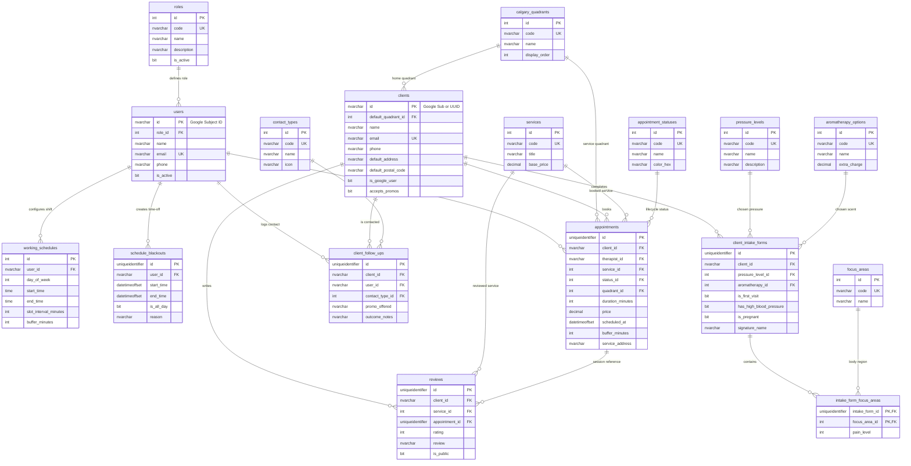

# FORM Wellness & Recovery — Database Schema Specification

**Database Name:** `form_wellness_db` (or `form_db`)  
**Engine:** Microsoft Azure SQL Database / Microsoft SQL Server 2022+  
**ORM Support:** Entity Framework Core (`Microsoft.EntityFrameworkCore.SqlServer`) & Dapper  
**Architecture:** 100% Normalized Relational Model, Dynamic Catalog Tables (Zero hardcoded enum/check constraints).

---

## 🗺️ 1. Entity-Relationship Diagram (ERD)



---

## 💾 2. Complete Microsoft Azure SQL Database (T-SQL) DDL Script

```sql
-- ============================================================================
-- DATABASE INITIALIZATION SCRIPT FOR: form_wellness_db (Azure SQL Database)
-- ============================================================================

-- ============================================================================
-- MODULE 1: DYNAMIC CATALOG TABLES (Master Lookups)
-- ============================================================================

-- 1. System Roles
CREATE TABLE roles (
    id INT IDENTITY(1,1) PRIMARY KEY CLUSTERED,
    code NVARCHAR(50) NOT NULL CONSTRAINT uq_roles_code UNIQUE,  -- 'ADMIN', 'THERAPIST', 'STAFF'
    name NVARCHAR(100) NOT NULL,
    description NVARCHAR(MAX),
    is_active BIT NOT NULL CONSTRAINT df_roles_is_active DEFAULT 1,
    created_at DATETIMEOFFSET NOT NULL CONSTRAINT df_roles_created_at DEFAULT SYSDATETIMEOFFSET()
);

-- 2. Calgary Geographic Quadrants
CREATE TABLE calgary_quadrants (
    id INT IDENTITY(1,1) PRIMARY KEY CLUSTERED,
    code NVARCHAR(20) NOT NULL CONSTRAINT uq_quadrants_code UNIQUE,  -- 'NW', 'SW', 'SE', 'NE', 'DOWNTOWN', 'SURROUNDING'
    name NVARCHAR(100) NOT NULL,
    display_order INT NOT NULL CONSTRAINT df_quadrants_order DEFAULT 0,
    is_active BIT NOT NULL CONSTRAINT df_quadrants_is_active DEFAULT 1,
    created_at DATETIMEOFFSET NOT NULL CONSTRAINT df_quadrants_created_at DEFAULT SYSDATETIMEOFFSET()
);

-- 3. Massage Pressure Levels
CREATE TABLE pressure_levels (
    id INT IDENTITY(1,1) PRIMARY KEY CLUSTERED,
    code NVARCHAR(50) NOT NULL CONSTRAINT uq_pressure_levels_code UNIQUE,  -- 'LIGHT', 'MEDIUM', 'FIRM', 'DEEP_TISSUE'
    name NVARCHAR(100) NOT NULL,
    description NVARCHAR(MAX),
    display_order INT NOT NULL CONSTRAINT df_pressure_levels_order DEFAULT 0,
    is_active BIT NOT NULL CONSTRAINT df_pressure_levels_is_active DEFAULT 1,
    created_at DATETIMEOFFSET NOT NULL CONSTRAINT df_pressure_levels_created_at DEFAULT SYSDATETIMEOFFSET()
);

-- 4. Aromatherapy & Essential Oil Options
CREATE TABLE aromatherapy_options (
    id INT IDENTITY(1,1) PRIMARY KEY CLUSTERED,
    code NVARCHAR(50) NOT NULL CONSTRAINT uq_aromatherapy_code UNIQUE,  -- 'UNSCENTED', 'EUCALYPTUS', 'LAVENDER', 'PEPPERMINT'
    name NVARCHAR(100) NOT NULL,
    description NVARCHAR(MAX),
    extra_charge DECIMAL(10, 2) NOT NULL CONSTRAINT df_aromatherapy_charge DEFAULT 0.00,
    display_order INT NOT NULL CONSTRAINT df_aromatherapy_order DEFAULT 0,
    is_active BIT NOT NULL CONSTRAINT df_aromatherapy_is_active DEFAULT 1,
    created_at DATETIMEOFFSET NOT NULL CONSTRAINT df_aromatherapy_created_at DEFAULT SYSDATETIMEOFFSET()
);

-- 5. Body Focus & Pain Areas
CREATE TABLE focus_areas (
    id INT IDENTITY(1,1) PRIMARY KEY CLUSTERED,
    code NVARCHAR(50) NOT NULL CONSTRAINT uq_focus_areas_code UNIQUE,  -- 'NECK', 'SHOULDERS', 'UPPER_BACK', 'LOWER_BACK', etc.
    name NVARCHAR(100) NOT NULL,
    description NVARCHAR(MAX),
    display_order INT NOT NULL CONSTRAINT df_focus_areas_order DEFAULT 0,
    is_active BIT NOT NULL CONSTRAINT df_focus_areas_is_active DEFAULT 1,
    created_at DATETIMEOFFSET NOT NULL CONSTRAINT df_focus_areas_created_at DEFAULT SYSDATETIMEOFFSET()
);

-- 6. Massage Services Catalog
CREATE TABLE services (
    id INT IDENTITY(1,1) PRIMARY KEY CLUSTERED,
    code NVARCHAR(80) NOT NULL CONSTRAINT uq_services_code UNIQUE,  -- 'DEEP_TISSUE', 'THERAPEUTIC_SWEDISH', 'HOT_STONE', etc.
    title NVARCHAR(150) NOT NULL,
    tagline NVARCHAR(255),
    description NVARCHAR(MAX),
    available_durations_min NVARCHAR(100) NOT NULL CONSTRAINT df_services_durations DEFAULT N'[60, 90, 120]', -- JSON array format
    base_price DECIMAL(10, 2) NOT NULL,
    badge NVARCHAR(80),
    icon NVARCHAR(80),
    image_url NVARCHAR(MAX),
    display_order INT NOT NULL CONSTRAINT df_services_order DEFAULT 0,
    is_active BIT NOT NULL CONSTRAINT df_services_is_active DEFAULT 1,
    created_at DATETIMEOFFSET NOT NULL CONSTRAINT df_services_created_at DEFAULT SYSDATETIMEOFFSET()
);

-- 7. Appointment Lifecycle Statuses
CREATE TABLE appointment_statuses (
    id INT IDENTITY(1,1) PRIMARY KEY CLUSTERED,
    code NVARCHAR(50) NOT NULL CONSTRAINT uq_appointment_statuses_code UNIQUE,  -- 'PENDING', 'CONFIRMED', 'EN_ROUTE', 'COMPLETED', 'CANCELLED'
    name NVARCHAR(100) NOT NULL,
    color_hex NVARCHAR(10) NOT NULL CONSTRAINT df_appointment_statuses_color DEFAULT N'#5A7B6E',
    description NVARCHAR(MAX),
    display_order INT NOT NULL CONSTRAINT df_appointment_statuses_order DEFAULT 0,
    is_active BIT NOT NULL CONSTRAINT df_appointment_statuses_is_active DEFAULT 1,
    created_at DATETIMEOFFSET NOT NULL CONSTRAINT df_appointment_statuses_created_at DEFAULT SYSDATETIMEOFFSET()
);

-- 8. Customer Contact Channels (CRM)
CREATE TABLE contact_types (
    id INT IDENTITY(1,1) PRIMARY KEY CLUSTERED,
    code NVARCHAR(50) NOT NULL CONSTRAINT uq_contact_types_code UNIQUE,  -- 'PHONE_CALL', 'WHATSAPP', 'EMAIL_PROMO', 'IN_PERSON'
    name NVARCHAR(100) NOT NULL,
    icon NVARCHAR(50),
    is_active BIT NOT NULL CONSTRAINT df_contact_types_is_active DEFAULT 1,
    created_at DATETIMEOFFSET NOT NULL CONSTRAINT df_contact_types_created_at DEFAULT SYSDATETIMEOFFSET()
);

-- ============================================================================
-- MODULE 2: USERS, CLIENTS & CRM
-- ============================================================================

-- 9. Staff & Administrators (Francis & Therapists)
CREATE TABLE users (
    id NVARCHAR(128) NOT NULL PRIMARY KEY CLUSTERED,  -- Google Subject ID
    role_id INT NOT NULL CONSTRAINT fk_users_role FOREIGN KEY REFERENCES roles(id),
    name NVARCHAR(150) NOT NULL,
    email NVARCHAR(255) NOT NULL CONSTRAINT uq_users_email UNIQUE,
    picture NVARCHAR(MAX),
    phone NVARCHAR(30),
    is_active BIT NOT NULL CONSTRAINT df_users_is_active DEFAULT 1,
    created_at DATETIMEOFFSET NOT NULL CONSTRAINT df_users_created_at DEFAULT SYSDATETIMEOFFSET(),
    last_login_at DATETIMEOFFSET NULL
);
CREATE NONCLUSTERED INDEX idx_users_email ON users(email);

-- 10. Clients / Patients
CREATE TABLE clients (
    id NVARCHAR(128) NOT NULL PRIMARY KEY CLUSTERED,  -- Google Subject ID or GUID for guests
    default_quadrant_id INT NULL CONSTRAINT fk_clients_quadrant FOREIGN KEY REFERENCES calgary_quadrants(id) ON DELETE SET NULL,
    name NVARCHAR(150) NOT NULL,
    email NVARCHAR(255) NOT NULL CONSTRAINT uq_clients_email UNIQUE,
    phone NVARCHAR(30),
    picture NVARCHAR(MAX),
    default_address NVARCHAR(MAX),
    default_postal_code NVARCHAR(10),
    is_google_user BIT NOT NULL CONSTRAINT df_clients_is_google DEFAULT 1,
    private_notes NVARCHAR(MAX),                      -- Francis' private clinical/relationship notes
    accepts_promos BIT NOT NULL CONSTRAINT df_clients_accepts_promos DEFAULT 1,
    created_at DATETIMEOFFSET NOT NULL CONSTRAINT df_clients_created_at DEFAULT SYSDATETIMEOFFSET(),
    updated_at DATETIMEOFFSET NOT NULL CONSTRAINT df_clients_updated_at DEFAULT SYSDATETIMEOFFSET()
);
CREATE NONCLUSTERED INDEX idx_clients_email ON clients(email);

-- 11. CRM Client Follow-ups & Promotion Tracking
CREATE TABLE client_follow_ups (
    id UNIQUEIDENTIFIER NOT NULL PRIMARY KEY CLUSTERED CONSTRAINT df_client_follow_ups_id DEFAULT NEWSEQUENTIALID(),
    client_id NVARCHAR(128) NOT NULL CONSTRAINT fk_follow_ups_client FOREIGN KEY REFERENCES clients(id) ON DELETE CASCADE,
    user_id NVARCHAR(128) NOT NULL CONSTRAINT fk_follow_ups_user FOREIGN KEY REFERENCES users(id),
    contact_type_id INT NOT NULL CONSTRAINT fk_follow_ups_contact_type FOREIGN KEY REFERENCES contact_types(id),
    promo_offered NVARCHAR(150),
    outcome_notes NVARCHAR(MAX),
    created_at DATETIMEOFFSET NOT NULL CONSTRAINT df_follow_ups_created_at DEFAULT SYSDATETIMEOFFSET()
);
CREATE NONCLUSTERED INDEX idx_follow_ups_client ON client_follow_ups(client_id);

-- ============================================================================
-- MODULE 3: CLINICAL INTAKE FORM (Alberta PIPA Compliance)
-- ============================================================================

-- 12. Client Clinical Intake Form
CREATE TABLE client_intake_forms (
    id UNIQUEIDENTIFIER NOT NULL PRIMARY KEY CLUSTERED CONSTRAINT df_intake_forms_id DEFAULT NEWSEQUENTIALID(),
    client_id NVARCHAR(128) NOT NULL CONSTRAINT fk_intake_forms_client FOREIGN KEY REFERENCES clients(id) ON DELETE CASCADE,
    pressure_level_id INT NOT NULL CONSTRAINT fk_intake_forms_pressure FOREIGN KEY REFERENCES pressure_levels(id),
    aromatherapy_id INT NOT NULL CONSTRAINT fk_intake_forms_aromatherapy FOREIGN KEY REFERENCES aromatherapy_options(id),
    
    -- Medical & Health Conditions
    is_first_visit BIT NOT NULL CONSTRAINT df_intake_first_visit DEFAULT 1,
    has_high_blood_pressure BIT NOT NULL CONSTRAINT df_intake_hbp DEFAULT 0,
    is_pregnant BIT NOT NULL CONSTRAINT df_intake_pregnant DEFAULT 0,
    pregnancy_weeks NVARCHAR(20),
    has_recent_surgeries_or_injuries BIT NOT NULL CONSTRAINT df_intake_surgeries DEFAULT 0,
    surgeries_details NVARCHAR(MAX),
    has_allergies_to_oils_or_nuts BIT NOT NULL CONSTRAINT df_intake_allergies DEFAULT 0,
    allergies_details NVARCHAR(MAX),
    other_health_notes NVARCHAR(MAX),
    
    -- Legal Consent (Alberta PIPA & Cancellation Policy)
    pipa_consent_accepted BIT NOT NULL CONSTRAINT df_intake_pipa DEFAULT 0,
    cancellation_policy_accepted BIT NOT NULL CONSTRAINT df_intake_cancellation DEFAULT 0,
    signature_name NVARCHAR(150) NOT NULL,
    
    is_latest BIT NOT NULL CONSTRAINT df_intake_is_latest DEFAULT 1,
    completed_at DATETIMEOFFSET NOT NULL CONSTRAINT df_intake_completed_at DEFAULT SYSDATETIMEOFFSET(),
    updated_at DATETIMEOFFSET NOT NULL CONSTRAINT df_intake_updated_at DEFAULT SYSDATETIMEOFFSET()
);
CREATE NONCLUSTERED INDEX idx_intake_client ON client_intake_forms(client_id);

-- 13. Junction Table: Focus Areas Marked on Intake Form
CREATE TABLE intake_form_focus_areas (
    intake_form_id UNIQUEIDENTIFIER NOT NULL CONSTRAINT fk_intake_fa_form FOREIGN KEY REFERENCES client_intake_forms(id) ON DELETE CASCADE,
    focus_area_id INT NOT NULL CONSTRAINT fk_intake_fa_area FOREIGN KEY REFERENCES focus_areas(id),
    pain_level INT NULL CONSTRAINT chk_pain_level CHECK (pain_level BETWEEN 1 AND 10),
    created_at DATETIMEOFFSET NOT NULL CONSTRAINT df_intake_fa_created_at DEFAULT SYSDATETIMEOFFSET(),
    CONSTRAINT pk_intake_form_focus_areas PRIMARY KEY CLUSTERED (intake_form_id, focus_area_id)
);
CREATE NONCLUSTERED INDEX idx_intake_focus_areas ON intake_form_focus_areas(focus_area_id);

-- ============================================================================
-- MODULE 4: SCHEDULES, BLACKOUTS & APPOINTMENTS
-- ============================================================================

-- 14. Weekly Working Schedules for Francis
CREATE TABLE working_schedules (
    id INT IDENTITY(1,1) PRIMARY KEY CLUSTERED,
    user_id NVARCHAR(128) NOT NULL CONSTRAINT fk_working_schedules_user FOREIGN KEY REFERENCES users(id) ON DELETE CASCADE,
    day_of_week INT NOT NULL CONSTRAINT chk_working_schedules_dow CHECK (day_of_week BETWEEN 0 AND 6), -- 0=Sunday, 1=Monday, ..., 6=Saturday
    start_time TIME(0) NOT NULL,              -- e.g. '08:00:00'
    end_time TIME(0) NOT NULL,                -- e.g. '20:00:00'
    slot_interval_minutes INT NOT NULL CONSTRAINT df_ws_slot_interval DEFAULT 30, -- :00 and :30 alignment
    buffer_minutes INT NOT NULL CONSTRAINT df_ws_buffer DEFAULT 30,                -- Travel & reset time
    is_active BIT NOT NULL CONSTRAINT df_ws_is_active DEFAULT 1,
    created_at DATETIMEOFFSET NOT NULL CONSTRAINT df_ws_created_at DEFAULT SYSDATETIMEOFFSET(),
    CONSTRAINT uq_working_schedules_user_day UNIQUE (user_id, day_of_week)
);

-- 15. Schedule Blackouts (Vacations, Personal Days & Blocked Hours)
CREATE TABLE schedule_blackouts (
    id UNIQUEIDENTIFIER NOT NULL PRIMARY KEY CLUSTERED CONSTRAINT df_blackouts_id DEFAULT NEWSEQUENTIALID(),
    user_id NVARCHAR(128) NOT NULL CONSTRAINT fk_blackouts_user FOREIGN KEY REFERENCES users(id) ON DELETE CASCADE,
    start_time DATETIMEOFFSET NOT NULL,
    end_time DATETIMEOFFSET NOT NULL,
    is_all_day BIT NOT NULL CONSTRAINT df_blackouts_is_all_day DEFAULT 0,
    reason NVARCHAR(150),
    created_at DATETIMEOFFSET NOT NULL CONSTRAINT df_blackouts_created_at DEFAULT SYSDATETIMEOFFSET()
);
CREATE NONCLUSTERED INDEX idx_blackouts_lookup ON schedule_blackouts(user_id, start_time, end_time);

-- 16. Appointments & Bookings
CREATE TABLE appointments (
    id UNIQUEIDENTIFIER NOT NULL PRIMARY KEY CLUSTERED CONSTRAINT df_appointments_id DEFAULT NEWSEQUENTIALID(),
    client_id NVARCHAR(128) NOT NULL CONSTRAINT fk_appointments_client FOREIGN KEY REFERENCES clients(id) ON DELETE CASCADE,
    therapist_id NVARCHAR(128) NOT NULL CONSTRAINT fk_appointments_therapist FOREIGN KEY REFERENCES users(id),
    service_id INT NOT NULL CONSTRAINT fk_appointments_service FOREIGN KEY REFERENCES services(id),
    status_id INT NOT NULL CONSTRAINT fk_appointments_status FOREIGN KEY REFERENCES appointment_statuses(id),
    quadrant_id INT NOT NULL CONSTRAINT fk_appointments_quadrant FOREIGN KEY REFERENCES calgary_quadrants(id),
    
    duration_minutes INT NOT NULL,             -- 60, 90, 120
    price DECIMAL(10, 2) NOT NULL,             -- CAD price
    scheduled_at DATETIMEOFFSET NOT NULL,
    buffer_minutes INT NOT NULL CONSTRAINT df_appointments_buffer DEFAULT 30, -- Extra buffer blocking calendar
    
    service_address NVARCHAR(MAX) NOT NULL,    -- In-home address in Calgary
    postal_code NVARCHAR(10),                  -- e.g., 'T2P 2C4'
    client_special_notes NVARCHAR(MAX),
    therapist_clinical_notes NVARCHAR(MAX),    -- Francis' clinical post-treatment notes
    
    created_at DATETIMEOFFSET NOT NULL CONSTRAINT df_appointments_created_at DEFAULT SYSDATETIMEOFFSET(),
    updated_at DATETIMEOFFSET NOT NULL CONSTRAINT df_appointments_updated_at DEFAULT SYSDATETIMEOFFSET()
);
CREATE NONCLUSTERED INDEX idx_appointments_client ON appointments(client_id);
CREATE NONCLUSTERED INDEX idx_appointments_therapist ON appointments(therapist_id);
CREATE NONCLUSTERED INDEX idx_appointments_scheduled_at ON appointments(scheduled_at);

-- ============================================================================
-- MODULE 5: CLIENT REVIEWS & TESTIMONIALS
-- ============================================================================

-- 17. Client Reviews
CREATE TABLE reviews (
    id UNIQUEIDENTIFIER NOT NULL PRIMARY KEY CLUSTERED CONSTRAINT df_reviews_id DEFAULT NEWSEQUENTIALID(),
    client_id NVARCHAR(128) NOT NULL CONSTRAINT fk_reviews_client FOREIGN KEY REFERENCES clients(id) ON DELETE NO ACTION,
    service_id INT NULL CONSTRAINT fk_reviews_service FOREIGN KEY REFERENCES services(id) ON DELETE SET NULL,
    appointment_id UNIQUEIDENTIFIER NULL CONSTRAINT fk_reviews_appointment FOREIGN KEY REFERENCES appointments(id) ON DELETE NO ACTION,
    
    rating INT NOT NULL CONSTRAINT chk_reviews_rating CHECK (rating BETWEEN 1 AND 5),
    review NVARCHAR(MAX) NOT NULL,
    
    is_public BIT NOT NULL CONSTRAINT df_reviews_is_public DEFAULT 1,
    created_at DATETIMEOFFSET NOT NULL CONSTRAINT df_reviews_created_at DEFAULT SYSDATETIMEOFFSET()
);
CREATE NONCLUSTERED INDEX idx_reviews_public ON reviews(is_public, created_at DESC);
CREATE NONCLUSTERED INDEX idx_reviews_client ON reviews(client_id);

-- ============================================================================
-- MODULE 6: INITIAL SEED DATA (T-SQL)
-- ============================================================================

-- Roles
INSERT INTO roles (code, name, description) VALUES
(N'ADMIN', N'Administrator', N'Francis - Full system ownership, clients, CRM, schedules, and configurations'),
(N'THERAPIST', N'Registered Massage Therapist (RMT)', N'Access to assigned appointments, addresses, and clinical notes'),
(N'STAFF', N'Receptionist / Assistant', N'Basic booking management and client inquiries');

-- Calgary Quadrants
INSERT INTO calgary_quadrants (code, name, display_order) VALUES
(N'NW', N'Northwest (NW)', 1),
(N'SW', N'Southwest (SW)', 2),
(N'SE', N'Southeast (SE)', 3),
(N'NE', N'Northeast (NE)', 4),
(N'DOWNTOWN', N'Downtown / Beltline', 5),
(N'SURROUNDING', N'Surrounding Calgary Area', 6);

-- Pressure Levels
INSERT INTO pressure_levels (code, name, description, display_order) VALUES
(N'LIGHT', N'Light & Gentle', N'Gentle, soothing touch for surface relaxation and stress relief', 1),
(N'MEDIUM', N'Medium (Balanced)', N'Harmonious balance between muscular relief and relaxation', 2),
(N'FIRM', N'Firm (Therapeutic)', N'Firm, targeted pressure designed to release stubborn tension knots', 3),
(N'DEEP_TISSUE', N'Deep Tissue (Intense)', N'Deep, sustained pressure on inner muscle layers and connective fascia', 4);

-- Aromatherapy Options
INSERT INTO aromatherapy_options (code, name, description, extra_charge, display_order) VALUES
(N'UNSCENTED', N'Unscented (Fragrance-Free)', N'Pure organic hypoallergenic carrier oil without fragrances', 0.00, 1),
(N'EUCALYPTUS', N'Nordic Eucalyptus & Pine', N'Clears respiratory airways, refreshes and revitalizes energy', 0.00, 2),
(N'LAVENDER', N'French Lavender Serenity', N'Promotes deep nervous system relaxation and restorative sleep', 0.00, 3),
(N'PEPPERMINT', N'Reviving Peppermint', N'Relieves tension headaches and stimulates muscular recovery', 0.00, 4),
(N'SWEET_ORANGE', N'Calgary Sunshine Sweet Orange', N'Elevates mood and dissolves daily emotional stress', 0.00, 5);

-- Focus Areas
INSERT INTO focus_areas (code, name, description, display_order) VALUES
(N'NECK', N'Neck & Cervical', N'Cervical tension and cranial base tightness', 1),
(N'SHOULDERS', N'Shoulders & Trapezius', N'Postural fatigue, trapezius knots and desk strain', 2),
(N'UPPER_BACK', N'Upper & Mid Back', N'Rhomboids, thoracic spine and shoulder blades', 3),
(N'LOWER_BACK', N'Lower Back (Lumbar)', N'Lumbar pain, sciatic nerve relief and stiffness', 4),
(N'ARMS_HANDS', N'Arms & Hands', N'Keyboard repetitive strain and forearm tightness', 5),
(N'HIPS_GLUTES', N'Hips & Glutes', N'Pelvic imbalance and sitting-induced tightness', 6),
(N'LEGS_FEET', N'Legs, Calves & Feet', N'Tired legs, calf cramps and plantar fascia', 7),
(N'FULL_BODY', N'Full Body Relaxation', N'Comprehensive, holistic body-wide relaxation', 8);

-- Services
INSERT INTO services (code, title, tagline, description, available_durations_min, base_price, badge, icon, image_url, display_order) VALUES
(N'THERAPEUTIC_SWEDISH', N'Therapeutic Swedish & Relaxation', N'Restorative, flowing pressure designed to melt away daily stress.', N'A gentle to medium-pressure therapeutic treatment utilizing long, rhythmic strokes to enhance circulation, reduce muscle tension, and calm the central nervous system.', N'[60, 90, 120]', 110.00, N'Most Popular', N'Heart', N'https://images.unsplash.com/photo-1544161515-4ab6ce6db874?auto=format&fit=crop&w=2400&q=85', 1),
(N'DEEP_TISSUE', N'Deep Tissue & Therapeutic Massage', N'Targeted relief for persistent tightness, knots, and chronic pain.', N'Focused firm pressure aimed at deeper muscle layers and connective tissues. Ideal for relieving neck stiffness, lower back pain, and posture fatigue from work or sports.', N'[60, 90, 120]', 125.00, N'Therapeutic Focus', N'Activity', N'https://images.unsplash.com/photo-1519823551278-64ac92734fb1?auto=format&fit=crop&w=2400&q=85', 2),
(N'HOT_STONE', N'Hot Stone Therapy', N'Deep thermal relaxation with natural volcanic basalt stones.', N'Heated smooth volcanic basalt stones massaged over tight muscles, melting away deep-seated tension, boosting circulation, and promoting total tranquility.', N'[75, 90]', 140.00, N'Deep Thermal Warmth', N'Flame', N'https://images.unsplash.com/photo-1600334129128-685c5582fd35?auto=format&fit=crop&w=2400&q=85', 3),
(N'PRENATAL', N'Prenatal Massage (Expecting Mothers)', N'Nurturing, safe care designed specifically for mothers-to-be.', N'Gentle and supportive techniques using specialized ergonomic positioning to ease lower back strain, reduce leg swelling, and promote restful sleep throughout pregnancy.', N'[60, 75]', 120.00, N'Maternity Care', N'Baby', N'https://images.unsplash.com/photo-1600334129128-685c5582fd35?auto=format&fit=crop&w=2400&q=85', 4),
(N'AROMATHERAPY', N'Aromatherapy Botanical Experience', N'Custom organic essential oil blends for sensory tranquility.', N'Combines restorative massage with therapeutic-grade botanical essential oils to harmonize the senses, release nervous tension, and restore inner vitality.', N'[60, 90]', 125.00, N'Botanical Essence', N'Leaf', N'https://images.unsplash.com/photo-1506126613408-eca07ce68773?auto=format&fit=crop&w=2400&q=85', 5),
(N'TRIGGER_POINT', N'Trigger Point & Sports Recovery', N'Targeted myofascial release for athletes and active lifestyles.', N'Focused pressure on neuromuscular trigger points to dissolve stubborn referral pain, restore range of motion, and accelerate post-workout muscular recovery.', N'[60, 90]', 130.00, N'Performance & Rehab', N'Zap', N'https://images.unsplash.com/photo-1518611012118-696072aa579a?auto=format&fit=crop&w=2400&q=85', 6);

-- Appointment Statuses
INSERT INTO appointment_statuses (code, name, color_hex, description, display_order) VALUES
(N'PENDING', N'Pending Confirmation', N'#C7B198', N'Newly booked by client, awaiting therapist confirmation', 1),
(N'CONFIRMED', N'Confirmed', N'#5A7B6E', N'Confirmed on Francis calendar and scheduled', 2),
(N'EN_ROUTE', N'En Route to Home', N'#4F6D7A', N'Therapist is driving to the clients home', 3),
(N'COMPLETED', N'Completed', N'#3F594F', N'Session completed successfully', 4),
(N'CANCELLED', N'Cancelled', N'#A84B4B', N'Cancelled by client or therapist', 5);

-- Contact Types
INSERT INTO contact_types (code, name, icon) VALUES
(N'PHONE_CALL', N'Phone Call', N'Phone'),
(N'WHATSAPP', N'WhatsApp Message', N'MessageSquare'),
(N'EMAIL_PROMO', N'Email Campaign', N'Mail'),
(N'IN_PERSON', N'In-Person Conversation', N'UserCheck');
```

---

## ⚡ 3. Entity Framework Core Configuration Guide (C# / .NET 10)

When configuring your `DbContext` for Azure SQL Database:

```csharp
// In FormWellness.Infrastructure/DependencyInjection.cs
services.AddDbContext<FormWellnessDbContext>(options =>
    options.UseSqlServer(
        configuration.GetConnectionString("DefaultConnection"),
        sqlOptions =>
        {
            sqlOptions.MigrationsAssembly(typeof(FormWellnessDbContext).Assembly.FullName);
            sqlOptions.EnableRetryOnFailure(
                maxRetryCount: 5,
                maxRetryDelay: TimeSpan.FromSeconds(30),
                errorNumbersToAdd: null);
        }));
```

### Connection String Template for Azure SQL Database

```json
{
  "ConnectionStrings": {
    "DefaultConnection": "Server=tcp:YOUR-SERVER-NAME.database.windows.net,1433;Initial Catalog=form_wellness_db;Persist Security Info=False;User ID=YOUR-ADMIN-USER;Password=YOUR-STRONG-PASSWORD;MultipleActiveResultSets=False;Encrypt=True;TrustServerCertificate=False;Connection Timeout=30;"
  }
}
```
