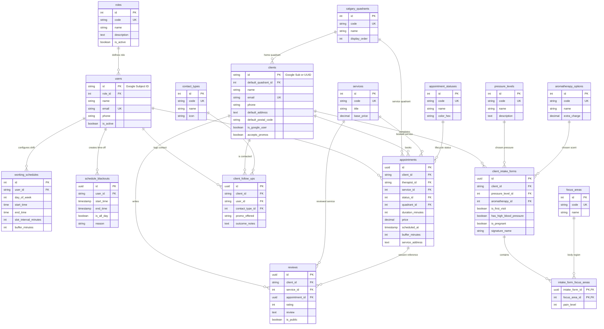

# FORM Wellness & Recovery — Database Schema Specification

**Database Name:** `form_wellness_db` (or `form_db`)  
**Engine:** PostgreSQL 15+ (Azure Database for PostgreSQL Flexible Server)  
**ORM Support:** Entity Framework Core (C# / ASP.NET Core) & Dapper  
**Architecture:** 100% Normalized Relational Model, Dynamic Catalog Tables (Zero hardcoded enum/check constraints).

---

## 🗺️ 1. Entity-Relationship Diagram (ERD)



---

## 💾 2. Complete PostgreSQL DDL Script

```sql
-- ============================================================================
-- DATABASE INITIALIZATION SCRIPT FOR: form_wellness_db
-- ============================================================================

-- Enable UUID extension for PostgreSQL
CREATE EXTENSION IF NOT EXISTS "uuid-ossp";
CREATE EXTENSION IF NOT EXISTS "pgcrypto";

-- ============================================================================
-- MODULE 1: DYNAMIC CATALOG TABLES (Master Lookups)
-- ============================================================================

-- 1. System Roles
CREATE TABLE roles (
    id SERIAL PRIMARY KEY,
    code VARCHAR(50) UNIQUE NOT NULL,         -- 'ADMIN', 'THERAPIST', 'STAFF'
    name VARCHAR(100) NOT NULL,
    description TEXT,
    is_active BOOLEAN NOT NULL DEFAULT TRUE,
    created_at TIMESTAMP WITH TIME ZONE NOT NULL DEFAULT NOW()
);

-- 2. Calgary Geographic Quadrants
CREATE TABLE calgary_quadrants (
    id SERIAL PRIMARY KEY,
    code VARCHAR(20) UNIQUE NOT NULL,         -- 'NW', 'SW', 'SE', 'NE', 'DOWNTOWN', 'SURROUNDING'
    name VARCHAR(100) NOT NULL,
    display_order INT NOT NULL DEFAULT 0,
    is_active BOOLEAN NOT NULL DEFAULT TRUE,
    created_at TIMESTAMP WITH TIME ZONE NOT NULL DEFAULT NOW()
);

-- 3. Massage Pressure Levels
CREATE TABLE pressure_levels (
    id SERIAL PRIMARY KEY,
    code VARCHAR(50) UNIQUE NOT NULL,         -- 'LIGHT', 'MEDIUM', 'FIRM', 'DEEP_TISSUE'
    name VARCHAR(100) NOT NULL,
    description TEXT,
    display_order INT NOT NULL DEFAULT 0,
    is_active BOOLEAN NOT NULL DEFAULT TRUE,
    created_at TIMESTAMP WITH TIME ZONE NOT NULL DEFAULT NOW()
);

-- 4. Aromatherapy & Essential Oil Options
CREATE TABLE aromatherapy_options (
    id SERIAL PRIMARY KEY,
    code VARCHAR(50) UNIQUE NOT NULL,         -- 'UNSCENTED', 'EUCALYPTUS', 'LAVENDER', 'PEPPERMINT'
    name VARCHAR(100) NOT NULL,
    description TEXT,
    extra_charge DECIMAL(10, 2) NOT NULL DEFAULT 0.00,
    display_order INT NOT NULL DEFAULT 0,
    is_active BOOLEAN NOT NULL DEFAULT TRUE,
    created_at TIMESTAMP WITH TIME ZONE NOT NULL DEFAULT NOW()
);

-- 5. Body Focus & Pain Areas
CREATE TABLE focus_areas (
    id SERIAL PRIMARY KEY,
    code VARCHAR(50) UNIQUE NOT NULL,         -- 'NECK', 'SHOULDERS', 'UPPER_BACK', 'LOWER_BACK', etc.
    name VARCHAR(100) NOT NULL,
    description TEXT,
    display_order INT NOT NULL DEFAULT 0,
    is_active BOOLEAN NOT NULL DEFAULT TRUE,
    created_at TIMESTAMP WITH TIME ZONE NOT NULL DEFAULT NOW()
);

-- 6. Massage Services Catalog
CREATE TABLE services (
    id SERIAL PRIMARY KEY,
    code VARCHAR(80) UNIQUE NOT NULL,         -- 'DEEP_TISSUE', 'THERAPEUTIC_SWEDISH', 'HOT_STONE', etc.
    title VARCHAR(150) NOT NULL,
    tagline VARCHAR(255),
    description TEXT,
    available_durations_min INT[] NOT NULL DEFAULT '{60, 90, 120}',
    base_price DECIMAL(10, 2) NOT NULL,
    badge VARCHAR(80),
    icon VARCHAR(80),
    image_url TEXT,
    display_order INT NOT NULL DEFAULT 0,
    is_active BOOLEAN NOT NULL DEFAULT TRUE,
    created_at TIMESTAMP WITH TIME ZONE NOT NULL DEFAULT NOW()
);

-- 7. Appointment Lifecycle Statuses
CREATE TABLE appointment_statuses (
    id SERIAL PRIMARY KEY,
    code VARCHAR(50) UNIQUE NOT NULL,         -- 'PENDING', 'CONFIRMED', 'EN_ROUTE', 'COMPLETED', 'CANCELLED'
    name VARCHAR(100) NOT NULL,
    color_hex VARCHAR(10) NOT NULL DEFAULT '#5A7B6E',
    description TEXT,
    display_order INT NOT NULL DEFAULT 0,
    is_active BOOLEAN NOT NULL DEFAULT TRUE,
    created_at TIMESTAMP WITH TIME ZONE NOT NULL DEFAULT NOW()
);

-- 8. Customer Contact Channels (CRM)
CREATE TABLE contact_types (
    id SERIAL PRIMARY KEY,
    code VARCHAR(50) UNIQUE NOT NULL,         -- 'PHONE_CALL', 'WHATSAPP', 'EMAIL_PROMO', 'IN_PERSON'
    name VARCHAR(100) NOT NULL,
    icon VARCHAR(50),
    is_active BOOLEAN NOT NULL DEFAULT TRUE,
    created_at TIMESTAMP WITH TIME ZONE NOT NULL DEFAULT NOW()
);

-- ============================================================================
-- MODULE 2: USERS, CLIENTS & CRM
-- ============================================================================

-- 9. Staff & Administrators (Francis & Therapists)
CREATE TABLE users (
    id VARCHAR(128) PRIMARY KEY,              -- Google Subject ID
    role_id INT NOT NULL REFERENCES roles(id) ON UPDATE CASCADE ON DELETE RESTRICT,
    name VARCHAR(150) NOT NULL,
    email VARCHAR(255) UNIQUE NOT NULL,
    picture TEXT,
    phone VARCHAR(30),
    is_active BOOLEAN NOT NULL DEFAULT TRUE,
    created_at TIMESTAMP WITH TIME ZONE NOT NULL DEFAULT NOW(),
    last_login_at TIMESTAMP WITH TIME ZONE
);
CREATE INDEX idx_users_email ON users(email);

-- 10. Clients / Patients
CREATE TABLE clients (
    id VARCHAR(128) PRIMARY KEY,              -- Google Subject ID or UUID for guests
    default_quadrant_id INT REFERENCES calgary_quadrants(id) ON DELETE SET NULL,
    name VARCHAR(150) NOT NULL,
    email VARCHAR(255) UNIQUE NOT NULL,
    phone VARCHAR(30),
    picture TEXT,
    default_address TEXT,
    default_postal_code VARCHAR(10),
    is_google_user BOOLEAN NOT NULL DEFAULT TRUE,
    private_notes TEXT,                        -- Francis' private clinical/relationship notes
    accepts_promos BOOLEAN NOT NULL DEFAULT TRUE,
    created_at TIMESTAMP WITH TIME ZONE NOT NULL DEFAULT NOW(),
    updated_at TIMESTAMP WITH TIME ZONE NOT NULL DEFAULT NOW()
);
CREATE INDEX idx_clients_email ON clients(email);

-- 11. CRM Client Follow-ups & Promotion Tracking
CREATE TABLE client_follow_ups (
    id UUID PRIMARY KEY DEFAULT gen_random_uuid(),
    client_id VARCHAR(128) NOT NULL REFERENCES clients(id) ON DELETE CASCADE,
    user_id VARCHAR(128) NOT NULL REFERENCES users(id) ON DELETE RESTRICT,
    contact_type_id INT NOT NULL REFERENCES contact_types(id) ON DELETE RESTRICT,
    promo_offered VARCHAR(150),
    outcome_notes TEXT,
    created_at TIMESTAMP WITH TIME ZONE NOT NULL DEFAULT NOW()
);
CREATE INDEX idx_follow_ups_client ON client_follow_ups(client_id);

-- ============================================================================
-- MODULE 3: CLINICAL INTAKE FORM (Alberta PIPA Compliance)
-- ============================================================================

-- 12. Client Clinical Intake Form
CREATE TABLE client_intake_forms (
    id UUID PRIMARY KEY DEFAULT gen_random_uuid(),
    client_id VARCHAR(128) NOT NULL REFERENCES clients(id) ON DELETE CASCADE,
    pressure_level_id INT NOT NULL REFERENCES pressure_levels(id) ON DELETE RESTRICT,
    aromatherapy_id INT NOT NULL REFERENCES aromatherapy_options(id) ON DELETE RESTRICT,
    
    -- Medical & Health Conditions
    is_first_visit BOOLEAN NOT NULL DEFAULT TRUE,
    has_high_blood_pressure BOOLEAN NOT NULL DEFAULT FALSE,
    is_pregnant BOOLEAN NOT NULL DEFAULT FALSE,
    pregnancy_weeks VARCHAR(20),
    has_recent_surgeries_or_injuries BOOLEAN NOT NULL DEFAULT FALSE,
    surgeries_details TEXT,
    has_allergies_to_oils_or_nuts BOOLEAN NOT NULL DEFAULT FALSE,
    allergies_details TEXT,
    other_health_notes TEXT,
    
    -- Legal Consent (Alberta PIPA & Cancellation Policy)
    pipa_consent_accepted BOOLEAN NOT NULL DEFAULT FALSE,
    cancellation_policy_accepted BOOLEAN NOT NULL DEFAULT FALSE,
    signature_name VARCHAR(150) NOT NULL,
    
    is_latest BOOLEAN NOT NULL DEFAULT TRUE,
    completed_at TIMESTAMP WITH TIME ZONE NOT NULL DEFAULT NOW(),
    updated_at TIMESTAMP WITH TIME ZONE NOT NULL DEFAULT NOW()
);
CREATE INDEX idx_intake_client ON client_intake_forms(client_id);

-- 13. Junction Table: Focus Areas Marked on Intake Form
CREATE TABLE intake_form_focus_areas (
    intake_form_id UUID NOT NULL REFERENCES client_intake_forms(id) ON DELETE CASCADE,
    focus_area_id INT NOT NULL REFERENCES focus_areas(id) ON DELETE RESTRICT,
    pain_level INT,                           -- Optional scale (1 to 10)
    created_at TIMESTAMP WITH TIME ZONE NOT NULL DEFAULT NOW(),
    PRIMARY KEY (intake_form_id, focus_area_id)
);
CREATE INDEX idx_intake_focus_areas ON intake_form_focus_areas(focus_area_id);

-- ============================================================================
-- MODULE 4: SCHEDULES, BLACKOUTS & APPOINTMENTS
-- ============================================================================

-- 14. Weekly Working Schedules for Francis
CREATE TABLE working_schedules (
    id SERIAL PRIMARY KEY,
    user_id VARCHAR(128) NOT NULL REFERENCES users(id) ON DELETE CASCADE,
    day_of_week INT NOT NULL CHECK (day_of_week BETWEEN 0 AND 6), -- 0=Sunday, 1=Monday, ..., 6=Saturday
    start_time TIME NOT NULL,                 -- e.g. '08:00:00'
    end_time TIME NOT NULL,                   -- e.g. '20:00:00'
    slot_interval_minutes INT NOT NULL DEFAULT 30, -- :00 and :30 alignment
    buffer_minutes INT NOT NULL DEFAULT 30,   -- Travel & reset time
    is_active BOOLEAN NOT NULL DEFAULT TRUE,
    created_at TIMESTAMP WITH TIME ZONE NOT NULL DEFAULT NOW(),
    UNIQUE (user_id, day_of_week)
);

-- 15. Schedule Blackouts (Vacations, Personal Days & Blocked Hours)
CREATE TABLE schedule_blackouts (
    id UUID PRIMARY KEY DEFAULT gen_random_uuid(),
    user_id VARCHAR(128) NOT NULL REFERENCES users(id) ON DELETE CASCADE,
    start_time TIMESTAMP WITH TIME ZONE NOT NULL,
    end_time TIMESTAMP WITH TIME ZONE NOT NULL,
    is_all_day BOOLEAN NOT NULL DEFAULT FALSE,
    reason VARCHAR(150),
    created_at TIMESTAMP WITH TIME ZONE NOT NULL DEFAULT NOW()
);
CREATE INDEX idx_blackouts_lookup ON schedule_blackouts(user_id, start_time, end_time);

-- 16. Appointments & Bookings
CREATE TABLE appointments (
    id UUID PRIMARY KEY DEFAULT gen_random_uuid(),
    client_id VARCHAR(128) NOT NULL REFERENCES clients(id) ON DELETE CASCADE,
    therapist_id VARCHAR(128) NOT NULL REFERENCES users(id) ON DELETE RESTRICT,
    service_id INT NOT NULL REFERENCES services(id) ON DELETE RESTRICT,
    status_id INT NOT NULL REFERENCES appointment_statuses(id) ON DELETE RESTRICT,
    quadrant_id INT NOT NULL REFERENCES calgary_quadrants(id) ON DELETE RESTRICT,
    
    duration_minutes INT NOT NULL,             -- 60, 90, 120
    price DECIMAL(10, 2) NOT NULL,             -- CAD price
    scheduled_at TIMESTAMP WITH TIME ZONE NOT NULL,
    buffer_minutes INT NOT NULL DEFAULT 30,    -- Extra buffer blocking calendar
    
    service_address TEXT NOT NULL,             -- In-home address in Calgary
    postal_code VARCHAR(10),                   -- e.g., 'T2P 2C4'
    client_special_notes TEXT,
    therapist_clinical_notes TEXT,             -- Francis' clinical post-treatment notes
    
    created_at TIMESTAMP WITH TIME ZONE NOT NULL DEFAULT NOW(),
    updated_at TIMESTAMP WITH TIME ZONE NOT NULL DEFAULT NOW()
);
CREATE INDEX idx_appointments_client ON appointments(client_id);
CREATE INDEX idx_appointments_therapist ON appointments(therapist_id);
CREATE INDEX idx_appointments_scheduled_at ON appointments(scheduled_at);

-- ============================================================================
-- MODULE 5: CLIENT REVIEWS & TESTIMONIALS
-- ============================================================================

-- 17. Client Reviews
CREATE TABLE reviews (
    id UUID PRIMARY KEY DEFAULT gen_random_uuid(),
    client_id VARCHAR(128) NOT NULL REFERENCES clients(id) ON DELETE CASCADE,
    service_id INT REFERENCES services(id) ON DELETE SET NULL,
    appointment_id UUID REFERENCES appointments(id) ON DELETE SET NULL,
    
    rating INT NOT NULL CHECK (rating BETWEEN 1 AND 5),
    review TEXT NOT NULL,
    
    is_public BOOLEAN NOT NULL DEFAULT TRUE,
    created_at TIMESTAMP WITH TIME ZONE NOT NULL DEFAULT NOW()
);
CREATE INDEX idx_reviews_public ON reviews(is_public, created_at DESC);
CREATE INDEX idx_reviews_client ON reviews(client_id);

-- ============================================================================
-- MODULE 6: INITIAL SEED DATA
-- ============================================================================

-- Roles
INSERT INTO roles (code, name, description) VALUES
('ADMIN', 'Administrator', 'Francis - Full system ownership, clients, CRM, schedules, and configurations'),
('THERAPIST', 'Registered Massage Therapist (RMT)', 'Access to assigned appointments, addresses, and clinical notes'),
('STAFF', 'Receptionist / Assistant', 'Basic booking management and client inquiries');

-- Calgary Quadrants
INSERT INTO calgary_quadrants (code, name, display_order) VALUES
('NW', 'Northwest (NW)', 1),
('SW', 'Southwest (SW)', 2),
('SE', 'Southeast (SE)', 3),
('NE', 'Northeast (NE)', 4),
('DOWNTOWN', 'Downtown / Beltline', 5),
('SURROUNDING', 'Surrounding Calgary Area', 6);

-- Pressure Levels
INSERT INTO pressure_levels (code, name, description, display_order) VALUES
('LIGHT', 'Light & Gentle', 'Gentle, soothing touch for surface relaxation and stress relief', 1),
('MEDIUM', 'Medium (Balanced)', 'Harmonious balance between muscular relief and relaxation', 2),
('FIRM', 'Firm (Therapeutic)', 'Firm, targeted pressure designed to release stubborn tension knots', 3),
('DEEP_TISSUE', 'Deep Tissue (Intense)', 'Deep, sustained pressure on inner muscle layers and connective fascia', 4);

-- Aromatherapy Options
INSERT INTO aromatherapy_options (code, name, description, extra_charge, display_order) VALUES
('UNSCENTED', 'Unscented (Fragrance-Free)', 'Pure organic hypoallergenic carrier oil without fragrances', 0.00, 1),
('EUCALYPTUS', 'Nordic Eucalyptus & Pine', 'Clears respiratory airways, refreshes and revitalizes energy', 0.00, 2),
('LAVENDER', 'French Lavender Serenity', 'Promotes deep nervous system relaxation and restorative sleep', 0.00, 3),
('PEPPERMINT', 'Reviving Peppermint', 'Relieves tension headaches and stimulates muscular recovery', 0.00, 4),
('SWEET_ORANGE', 'Calgary Sunshine Sweet Orange', 'Elevates mood and dissolves daily emotional stress', 0.00, 5);

-- Focus Areas
INSERT INTO focus_areas (code, name, description, display_order) VALUES
('NECK', 'Neck & Cervical', 'Cervical tension and cranial base tightness', 1),
('SHOULDERS', 'Shoulders & Trapezius', 'Postural fatigue, trapezius knots and desk strain', 2),
('UPPER_BACK', 'Upper & Mid Back', 'Rhomboids, thoracic spine and shoulder blades', 3),
('LOWER_BACK', 'Lower Back (Lumbar)', 'Lumbar pain, sciatic nerve relief and stiffness', 4),
('ARMS_HANDS', 'Arms & Hands', 'Keyboard repetitive strain and forearm tightness', 5),
('HIPS_GLUTES', 'Hips & Glutes', 'Pelvic imbalance and sitting-induced tightness', 6),
('LEGS_FEET', 'Legs, Calves & Feet', 'Tired legs, calf cramps and plantar fascia', 7),
('FULL_BODY', 'Full Body Relaxation', 'Comprehensive, holistic body-wide relaxation', 8);

-- Services
INSERT INTO services (code, title, tagline, description, available_durations_min, base_price, badge, icon, image_url, display_order) VALUES
('THERAPEUTIC_SWEDISH', 'Therapeutic Swedish & Relaxation', 'Restorative, flowing pressure designed to melt away daily stress.', 'A gentle to medium-pressure therapeutic treatment utilizing long, rhythmic strokes to enhance circulation, reduce muscle tension, and calm the central nervous system.', '{60, 90, 120}', 110.00, 'Most Popular', 'Heart', 'https://images.unsplash.com/photo-1544161515-4ab6ce6db874?auto=format&fit=crop&w=2400&q=85', 1),
('DEEP_TISSUE', 'Deep Tissue & Therapeutic Massage', 'Targeted relief for persistent tightness, knots, and chronic pain.', 'Focused firm pressure aimed at deeper muscle layers and connective tissues. Ideal for relieving neck stiffness, lower back pain, and posture fatigue from work or sports.', '{60, 90, 120}', 125.00, 'Therapeutic Focus', 'Activity', 'https://images.unsplash.com/photo-1519823551278-64ac92734fb1?auto=format&fit=crop&w=2400&q=85', 2),
('HOT_STONE', 'Hot Stone Therapy', 'Deep thermal relaxation with natural volcanic basalt stones.', 'Heated smooth volcanic basalt stones massaged over tight muscles, melting away deep-seated tension, boosting circulation, and promoting total tranquility.', '{75, 90}', 140.00, 'Deep Thermal Warmth', 'Flame', 'https://images.unsplash.com/photo-1600334129128-685c5582fd35?auto=format&fit=crop&w=2400&q=85', 3),
('PRENATAL', 'Prenatal Massage (Expecting Mothers)', 'Nurturing, safe care designed specifically for mothers-to-be.', 'Gentle and supportive techniques using specialized ergonomic positioning to ease lower back strain, reduce leg swelling, and promote restful sleep throughout pregnancy.', '{60, 75}', 120.00, 'Maternity Care', 'Baby', 'https://images.unsplash.com/photo-1600334129128-685c5582fd35?auto=format&fit=crop&w=2400&q=85', 4),
('AROMATHERAPY', 'Aromatherapy Botanical Experience', 'Custom organic essential oil blends for sensory tranquility.', 'Combines restorative massage with therapeutic-grade botanical essential oils to harmonize the senses, release nervous tension, and restore inner vitality.', '{60, 90}', 125.00, 'Botanical Essence', 'Leaf', 'https://images.unsplash.com/photo-1506126613408-eca07ce68773?auto=format&fit=crop&w=2400&q=85', 5),
('TRIGGER_POINT', 'Trigger Point & Sports Recovery', 'Targeted myofascial release for athletes and active lifestyles.', 'Focused pressure on neuromuscular trigger points to dissolve stubborn referral pain, restore range of motion, and accelerate post-workout muscular recovery.', '{60, 90}', 130.00, 'Performance & Rehab', 'Zap', 'https://images.unsplash.com/photo-1518611012118-696072aa579a?auto=format&fit=crop&w=2400&q=85', 6);

-- Appointment Statuses
INSERT INTO appointment_statuses (code, name, color_hex, description, display_order) VALUES
('PENDING', 'Pending Confirmation', '#C7B198', 'Newly booked by client, awaiting therapist confirmation', 1),
('CONFIRMED', 'Confirmed', '#5A7B6E', 'Confirmed on Francis calendar and scheduled', 2),
('EN_ROUTE', 'En Route to Home', '#4F6D7A', 'Therapist is driving to the clients home', 3),
('COMPLETED', 'Completed', '#3F594F', 'Session completed successfully', 4),
('CANCELLED', 'Cancelled', '#A84B4B', 'Cancelled by client or therapist', 5);

-- Contact Types
INSERT INTO contact_types (code, name, icon) VALUES
('PHONE_CALL', 'Phone Call', 'Phone'),
('WHATSAPP', 'WhatsApp Message', 'MessageSquare'),
('EMAIL_PROMO', 'Email Campaign', 'Mail'),
('IN_PERSON', 'In-Person Conversation', 'UserCheck');
